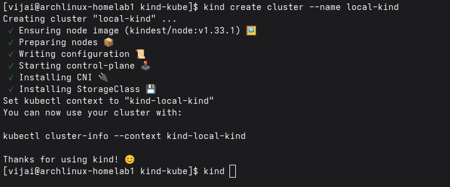
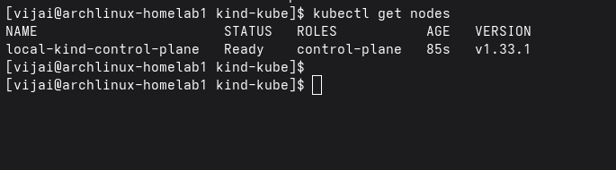

# kind local setup
To perform quick CICD testing and container application deployment testing on kubernetes during developement phase before deploying on Production/staging environment.

Following script will quickly install Kind on Ubuntu machine and steps are pretty much the same if you're using brew package on any linux distribution.

```
./kind-setup.sh
```

Quick Reference cmds once done with the Kind Installation:

```
$docker exec -it kind-control-plane bash ( optional)
$kind create cluster --name local-kind
$kind get clusters
```


```
$kubectl get nodes
$kubectl version
```


Finally, Delete the created cluster:
```
$kind delete cluster --name local-kind
```
Stop the Kind

```
$sudo systemctl stop kind
```

## Install Helm on Kind Cluster

```
curl -fsSL https://get.helm.sh/helm-v3.15.2-linux-amd64.tar.gz -o helm.tar.gz
tar -zxvf helm.tar.gz
sudo mv linux-amd64/helm /usr/local/bin/helm
rm -rf linux-amd64 helm.tar.gz
```
More details: https://helm.sh/docs/intro/install/

## Uninstall Helm 

```
helm list --all-namespace
helm uninstall RELEASE_NAME --namespace namespace

sudo rm /usr/local/bin/helm 

rm -rf ~/.cache/helm ~/.config/helm ~/.local/share/bin
```

## Install Cilium on Kind Cluster

```
kind create cluster --config kind-config-cilium.yaml
```

```
docker inspect -f '{{range .NetworkSettings.Networks}}{{.IPAddress}}{{end}}' kind-man-control-plane
```
```
helm repo add cilium https://helm.cilium.io/
helm repo update
```

```
helm install cilium cilium/cilium --version 1.15.5 \
   --namespace kube-system \
   --set kubeProxyReplacement=strict \
   --set k8sServiceHost=172.18.0.3
   --set k8sServicePort=6443
```

also, add if wanted
```
   --set hubble.relay.enabled=true
   --set hubble.ui.enabled=true
```

```
kubectl wait --for=condition=ready --timeout=5m -n kube-system pod -l k8s-app=cilium
```
```
kubectl apply -f cilium-l2-pool.yaml
```

## How to uninstall kind cluster

If kind cluster is not deleted before, then

```
kind delete cluster
```

and remove the kind binary

```
sudo rm /usr/local/bin/kind
```
#### Uninstall, Kubectl 

```
sudo rm /usr/local/bin/kubectl
```
if kubectl installed via apt-get in ubuntu then,

```
sudo apt-get purge kubectl 

sudo apt-get remove

rm -rf ~/.kube
```
